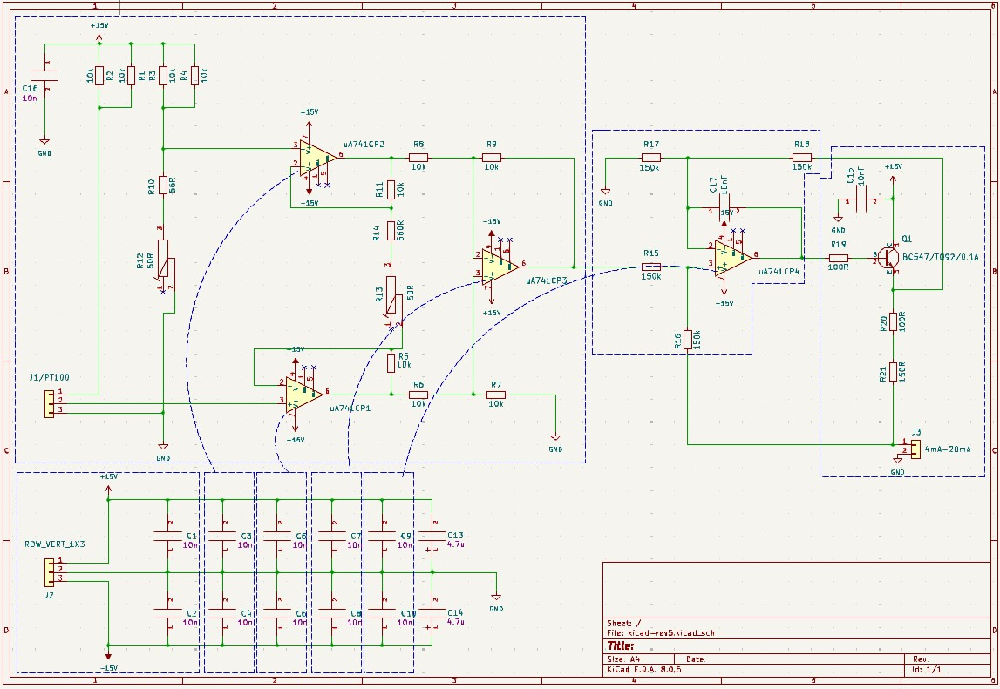
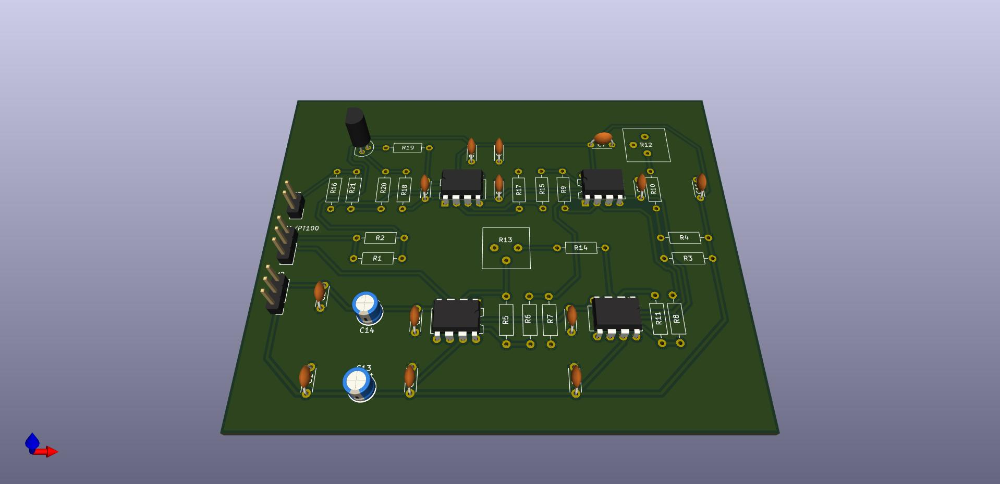

# Kicad - Project 1

## Description:
- Single-sided circuit board . 
- 0.5 mm clearance
- 0.5 mm signal width
- Functional blocks marked in the schematic picture
- PCB size 100 mm x 80 mm
- The connectors are 2.54 mm (pin spacing) vertical row connectors

## The schematic and 3D view:

